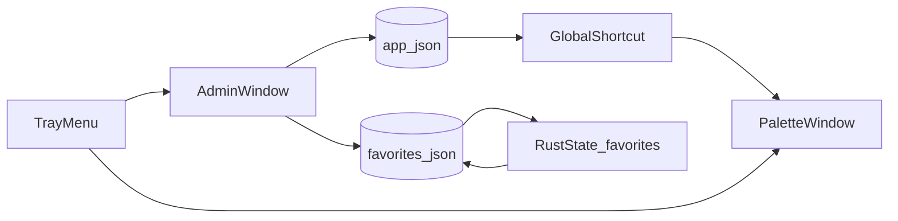

# Tauri 网页快开（Windows / React / Tailwind）实施规划

## 现状与目标对齐

- 仓库为 [D:/repo/project/my-tools](D:/repo/project/my-tools)：Vite + React 19、[`src-tauri/Cargo.toml`](src-tauri/Cargo.toml) 已引入 `tauri` 2、`tauri-plugin-opener`，[package.json](package.json) 尚**无** Tailwind。
- 你选择了：**免安装 = 以 `target/release` 等产物打 zip、数据与 exe 同目录**（可拷 U 盘）。

## 关键架构决定（已纳入方案）

1. **「点搜索条外关闭」+「约 800×50 居中偏上」**  
   小窗口若只做 800px 宽，**无法**收到「条外」的鼠标事件。业界通用做法是：**一个铺满当前工作区（或主屏工作区）的无边框、置顶、可透明/半透明窗口**，在垂直方向偏上、水平居中放 **约 800px 宽** 的条 + 下拉面；**其余全屏可点区域**触发关闭。视觉上仍是「长条+下拉」居中偏上。
2. **管理窗与速开失焦**  
   管理为**独立** `WebviewWindow`（`decorations: true`、有自带关闭键）。**打开管理时隐藏速开条**，避免与「失焦/点外」规则冲突。
3. **收藏「重启/重载后生效」**  
   速开列表在 **进程启动**时从 `favorites.json` 读入 **Rust 侧 `State<Mutex<...>>`**；管理端**只写文件**，不在内存中悄悄刷新速开用缓存。你在速开中输入 `/reload`（或自退出再开）后全进程重启，与需求一致。
4. **Windows 与 WebView2**  
   绿色 zip 需目标机安装 **WebView2 Runtime**（Tauri 常规要求）；在规划中注明，便于你预期部署环境。

## 技术栈与依赖

| 层级              | 内容                                                                                                                                                                                                                                       |
| ----------------- | ------------------------------------------------------------------------------------------------------------------------------------------------------------------------------------------------------------------------------------------ |
| 前端              | React + TypeScript + **Tailwind CSS**；路由/history 用 **hash 或 `?v=`** 区分各窗初始页（如 `#/palette`、`#/admin`）                                                                                                                       |
| Tauri 插件 / 能力 | 已有 `opener`；新增 **`tauri-plugin-global-shortcut`**、`tauri-plugin-autostart`、**`tauri-plugin-dialog`**（导入/导出选路径）；`tauri` 开 **`tray-icon`** 特性做托盘；文件读写**优先在 Rust 内**用 `std::fs` + 绝对路径，减少 FS scope 面 |
| 打开 URL          | 使用已有 [`@tauri-apps/plugin-opener`](https://v2.tauri.app/plugin/opener) 的 `openUrl`                                                                                                                                                    |

## 数据与路径（可移植 / 绿软）

- **目录**：`data_dir = current_exe().parent().unwrap()`（Tauri 内可用 `app.path().exe_dir` 等 API 封装一层，**统一从 Rust 算路径**发往前端，避免 CWD 歧义）。
- **文件**（建议，可微调命名）：
  - `favorites.json`：收藏列表（`title` / `url` / `addTime` 用 `YYYY-MM-DD HH:mm:ss` 串，与需求一致；导入校验通过后再覆盖）。
  - `app.json`：全局热键串（默认 `Alt+Space`）、是否开机自启、以及 UI/逻辑需要的其它小配置。
- **与 bundle**：**禁**用把数据打进 resource 的假设；**始终**以 exe 旁路径为准。

## Rust 层职责（`src-tauri/src/lib.rs` 为主）

- `setup`：
  - 建 **Tray**（`TrayIconBuilder`）：菜单项「打开 / 管理 / 开机启动（可勾选或独立命令同步）/ 退出」。
  - 从 `app.json` 读配置；注册 **global-shortcut**（启动时、以及将来若提供「改键后需重启」则读档重注册）。
  - 创建/持有 **`palette`（速开）**、**`admin`（管理）** 的 `WebviewWindow` 标签；启动时**仅托盘 + 热键有效**，`palette` 默认 `hidden`，`admin` 按需创建或常驻隐藏（择一，推荐按需创建减少内存）。
- **Commands 示例**（名称可落地时微调）：
  - 收藏：`get_favorites_snapshot`、`save_favorites_replace`、`import_favorites`（选文件 → 读入 → 校验 → 落盘 + 可返回错误原因）、`export_favorites`（选路径写 JSON）。
  - 系统：`relaunch_app`（`/reload` 调用）、`open_url_in_system_browser`（透传到 opener）、`get_paths_for_ui`（只读，便于管理页显示数据路径提示）。
  - 自启动：通过 **autostart 插件** 与 `app.json` 中的布尔位保持同步。
- **热键触达**：`Alt+Space` 回调里对 `palette` `show` + `set_focus` + 前可选 `center` 或按「工作区中上」逻辑 `set_position`；再次按下是否 toggle 可做成简单版「仅打开」。

## 前端层（`src/`）

- **入口**：`main.tsx` 根路由根据 `window.__TAURI__` + 当前 `WebviewWindow` 的 `label`（`getCurrentWindow().label`）或 location hash 渲染 **`PaletteApp`** 与 **`AdminApp`** 两套子树。
- **速开 `PaletteApp`**：
  - 输入框**受控**，**不** debounce 整个 input；**仅**对「用于过滤的字符串」`useRef`+`setTimeout(100ms)` 或等效，派生**过滤用 keyword**；列表 `useMemo` 依赖 keyword。
  - **命令分流**：`trim` 后 **`/admin`** 且 Enter → 调 Tauri 开管理并 `hide` 本窗；不进入 title 过滤。
  - **`/reload`** + Enter → invoke `relaunch_app`。
  - 普通模式：`invoke` 取**进程内快照**的收藏（启动时读盘），`title` 模糊含 keyword（忽略大小写；是否含 URL 由你定，下表建议 **仅 title**，与速开首句「过滤 title」一致）。
  - 键盘：↑/↓ 改「预选索引」；Enter 用 opener 打开；**打开后** `hide` 速开窗。
  - Esc：有内容先清空，无则 `hide`。
  - 样式：条 + 下拉浅灰、选中行更深灰、下拉区 `max-h-[600px] overflow-y-auto`、整窗圆角 10–12px、浅阴影/无阴影依你现稿（速开窗 **decorations: false**）。
- **管理 `AdminApp`**：
  - **Ant Design 表格 + 表单项** 或纯 Tailwind + 原生表格（为遵守你方「表单标题与控件同一行、不用 vertical layout、message 用 `window.messageApi`」等规则，**若**引入 antd，则按你 workspace 习惯接入 `App` 的 message context）。列：url、title、addTime、操作（编辑/删除），工具栏：搜索（title 或 url）、**新增**、**导入/导出**（dialog 选文件）。
  - 配置区：**全局热键**输入（保存到 `app.json` + 提示**重启/或调用 Rust 里注销再注册**）、**开机自启**开关。
  - 列表排序：按 `addTime` 降序（最近在上）；若同秒，可再按 title 作二级排序。
- **导入 JSON 校验**（可 Rust 上严格、前端可预检）：
  - 根类型为**数组**；每项为 object，**必填** `title`（非空 string）、`url`（string，建议 `https?://` 校验或至少非空 + 危险字符白名单）、`addTime`（与展示格式一致或宽松 ISO 再归一化）。
  - 任一项不通过则**拒绝**覆盖并返回可读错误。

## Tauri 配置

- [`src-tauri/tauri.conf.json`](src-tauri/tauri.conf.json)：
  - 增加两个 window 的 label/url（或一个默认 `hidden` 的占位列 + 全动态创建，二选一并写清注释）。
  - `bundle`：**仅 Windows**（`targets` 用 `nsis`/`msi` 可关，与你「zip 为主」— 实际打 zip 用 release 子集即可）。
- [`src-tauri/capabilities/`](src-tauri/capabilities/)：为各窗或共享 capability 配齐 `opener`、`global-shortcut`、`dialog`、**autostart** 等 `allow` 项（依插件文档精确列出）。

## 构建与发布（zip）

- 日常：`npm run tauri build`（或 `tauri build`），在 `src-tauri/target/release/` 取得 `my-tools.exe`（名称以 `productName` 为准）及同目录下运行所需**侧载**文件（若有 WebView2 本地 loader 等，以实际生成物为准）。
- 用脚本/CI 将 **exe + 数据文件（首次可为空/模板）+ 若需说明.txt** 打进 `my-tools-win-portable.zip`。
- 注明：**首次**可在 exe 旁若不存在 `favorites.json` 则自动写 `[]`；`app.json` 同理默认。

## 风险与注意点

- **Alt+Space** 在部分 Windows/输入法环境下可能被系统占用，需在「设置里可改键」+ 说明文档。
- 多显示器「居中偏上」以**主显示器工作区**为基准，首版可如此；后若有需求再精调。
- 全局快捷键的「字符串」与 `global-shortcut` 的格式一致（文档中的 `+` 连接符等），保存前可做简单预校验。

## 数据流简图

## 实现顺序建议

1. 依赖与 Tailwind、双窗骨架（label + 占位 UI）、托盘能弹出「打开/退出」。
2. Rust：exe 旁路径、读写 `favorites.json` / `app.json`、State、**opener 打开 http**。
3. 速开：过滤、Enter/Esc/外部点击、100ms 仅搜索防抖、/admin、/reload。
4. 管理：CRUD + 搜索 + 排序 + 导入/导出/校验。
5. `global-shortcut` + 与 `app.json` 同步；`autostart` 与菜单联动。
6. 打包说明与 zip 目录约定（含 WebView2 说明）。

以上步骤可在开发中交叉合并（例如托盘与热键可稍晚接），但依赖顺序上 **路径与 State 应先于** 复杂 UI。

### 你无需再答的问题

- 便携包：已选 **zip release**。
- 其它点若实现中发现与 uTools 手感差异，可在 PR 前微调动画与热键策略。
